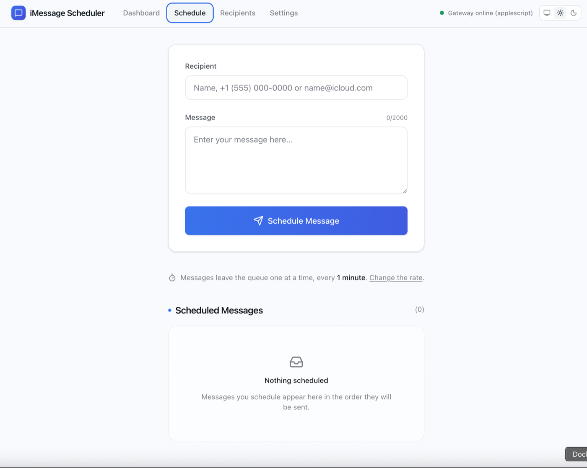

# iMessage Scheduler

Queue iMessages in a browser; a backend sends them **one per hour** (configurable)
through a **macOS gateway** that drives Messages.app and reads real delivery
status from `chat.db`.

<p align="center">
  
</p>

```
Browser ──REST + polling──▶ Server ──▶ Postgres  (the queue of record)
                              ▲
                              │ long-poll lease   ← the gateway dials out
                              │ status reports
                          Gateway ──osascript──▶ Messages.app
                              ▲                       │
                              └───── chat.db ◀────────┘
```

## Run it

Needs **Node 22+**, **Docker Desktop**, and for real sends a **Mac with Messages signed in**.

```bash
npm install
cp .env.example .env      # defaults work as-is
npm run db:setup          # Postgres in Docker + migrations
npm run dev               # api :4310, web :4320
```

Second terminal:

```bash
npm run gateway:setup     # once -- grants the two macOS permissions, guided
npm run gateway:real      # sends real iMessages from your account
```

Open **http://localhost:4320**. Set *Settings → Send rate → 10s*, schedule a
message to yourself, watch it go `QUEUED → SENT → DELIVERED` on the Dashboard.

Not on a Mac, or just working on the UI: `npm run gateway:mock` plays the same
lifecycle on timers with no permissions. CI runs against it.

| | Port | |
|---|---|---|
| Web | 4320 | Vite |
| API | 4310 | Express |
| Postgres | 5433 | Docker — off 5432 so it never touches a local install |

### macOS permissions

Two, and macOS only lets a human grant them:

| | For |
|---|---|
| **Full Disk Access** | reading `~/Library/Messages/chat.db` |
| **Automation** | driving Messages.app via `osascript` |

They belong to the app hosting your terminal (iTerm, Terminal, VS Code…), **not
to `node`**. `gateway:setup` names the right app, opens the right pane, and
waits for the grant to land. The dashboard shows a banner with a *Re-check*
button until both are in place. If a grant does not take, quit that app fully
and reopen it.

To keep the gateway running after you close the terminal:
`npm run gateway:install` (launchd, logs in `~/Library/Logs/sbta-gateway.log`).

### All commands

```bash
npm run dev             # api + web            npm run verify     # typecheck + lint + unit
npm run dev:all         # + gateway            npm test           # unit
npm run gateway:setup   # macOS permissions    npm run test:int   # integration (real Postgres)
npm run gateway:real    # real iMessages       npm run build
npm run gateway:mock    # simulated
npm run gateway:install # login service        npm run db:up / db:migrate / db:seed / db:studio
```

Whole stack in containers (gateway still native):
`docker compose -f docker-compose.yml -f docker-compose.full.yml up --build` → web :4330, api :4310.

## How it works

**Postgres is the queue.** Claiming is one raw query, the only place the code
leaves Prisma:

```sql
SELECT id FROM "messages" WHERE status = 'QUEUED'
ORDER BY "forceDispatch" DESC, "queueSeq" ASC
LIMIT 1 FOR UPDATE SKIP LOCKED
```

Any number of server instances claim *different* rows with no coordination.

**Claims are pull, not push.** Nothing dispatches on a timer; a message leaves
the queue only when a gateway asks. An offline gateway cannot burn slots.

**A lease and a reaper handle failure.** A claim holds the message for
`LEASE_SECONDS`; a sweep returns expired leases to `QUEUED`. That covers a
gateway crash, partition, or death mid-send.

**The same text is never sent twice.** `providerGuid` — the `chat.db` id of the
real message — is written once and survives a reap. A re-leased message that
already has one is re-attached, not re-sent. At-least-once delivery, idempotent
consumer.

**Status reports are guarded three ways.** They arrive duplicated and out of
order: the dispatch token must match the current attempt, a rank check stops a
late `SENT` overwriting `DELIVERED`, and `(messageId, status)` is unique so a
replay collides instead of duplicating.

**Send time is derived, not chosen.** `eta(i) = max(lastDispatchedAt + interval, now) + i × interval`,
computed on read. Cancelling or changing the rate re-times the queue for free.

**Recipients** are an address book keyed by the normalized handle
(`+12063456789`, `name@icloud.com`). Messages join to a name by that string at
read time — no foreign key, so naming someone labels their whole history.

Worth knowing: failed sends retry up to the attempt budget (Settings, default 3)
spaced by the send rate; `RECEIVED` needs the recipient's read receipts on, so
`DELIVERED` counts as success; 555 numbers are accepted (`isPossible`, not
`isValid`) because the mockup uses one; message bodies are never logged.

## Layout

```
apps/web        React 19 · Vite · Tailwind v4 · React Query
apps/server     Express 5 · Prisma 7 · Postgres
apps/gateway    Node · osascript · chat.db          (native macOS)
libs/shared     Zod schemas · status machine · ETA
infra/          Terraform: VPC, RDS, ECS Fargate, ALB, S3 + CloudFront
docs/specs      one per domain · docs/adr  the decisions
```

Nx on npm workspaces.

## Testing

`npm test` — 203 unit tests, no database. `npm run test:int` — 84 against real
Postgres, including five concurrent claims returning five different rows, reaper
reclaim, stale-token rejection, and the GUID surviving a reap. Both run in CI.

## Deployment

GitHub → Docker → ECR → Terraform → AWS, via GitHub OIDC (no stored keys).
Terraform is validated in CI and planned by a manual release workflow; it is
never applied here.

The gateway cannot run in AWS — it needs a signed-in Messages account — so it
lives on a Mac. Because it dials out, that Mac needs no inbound rules, VPN, or
public IP. See [`docs/specs/05-deployment.md`](docs/specs/05-deployment.md).

## Docs

[Overview](docs/specs/00-overview.md) ·
[Shared](docs/specs/01-shared.md) ·
[Server](docs/specs/02-server.md) ·
[Gateway](docs/specs/03-gateway.md) ·
[Web](docs/specs/04-web.md) ·
[Deployment](docs/specs/05-deployment.md) ·
ADRs: [Postgres as the queue](docs/adr/0001-postgres-as-the-queue.md) ·
[No broker](docs/adr/0002-no-message-broker.md) ·
[Pull-based gateway](docs/adr/0003-pull-based-gateway.md)
